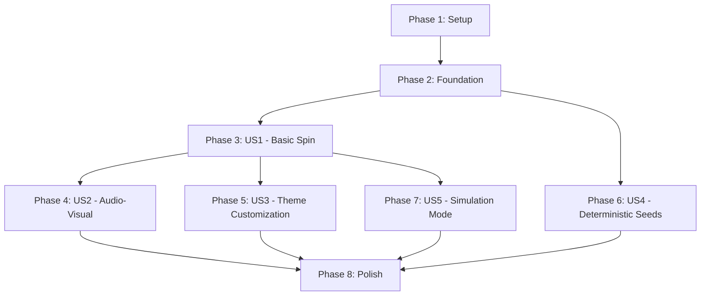

# Tasks: Slot Machine Engine

**Input**: Design documents from `/specs/001-slot-engine/`
**Prerequisites**: plan.md (required), spec.md (required), research.md, data-model.md, contracts/

**Tests**: Tests are included per specification requirements for validation and quality assurance.

**Organization**: Tasks are grouped by user story to enable independent implementation and testing of each story.

## Format: `[ID] [P?] [Story] Description`

- **[P]**: Can run in parallel (different files, no dependencies)
- **[Story]**: Which user story this task belongs to (e.g., US1, US2, US3)
- Include exact file paths in descriptions

## Path Conventions

- **Single project**: `src/`, `tests/` at repository root
- Paths shown below are for single TypeScript library project

---

## Phase 1: Setup (Shared Infrastructure)

**Purpose**: Project initialization and basic structure

- [X] T001 Create project structure per implementation plan (src/, tests/, demo/ directories)
- [X] T002 Initialize TypeScript project with tsconfig.json (ES2022 target, strict mode, browser compatible)
- [X] T003 [P] Configure package.json with type: "module", exports for SlotEngine
- [X] T004 [P] Setup testing framework (Jest or Vitest) with TypeScript support
- [X] T005 [P] Create .gitignore for node_modules, dist/, coverage/
- [X] T006 [P] Copy type definitions from contracts/types.ts to src/types.ts

---

## Phase 2: Foundational (Blocking Prerequisites)

**Purpose**: Core infrastructure that MUST be complete before ANY user story can be implemented

**⚠️ CRITICAL**: No user story work can begin until this phase is complete

- [X] T007 Implement SeededRandom class with Mulberry32 algorithm in src/core/RNG.ts
- [X] T008 Implement crypto-based random for unseeded mode in src/core/RNG.ts
- [X] T009 [P] Create Configuration entity with validation in src/models/Configuration.ts
- [X] T010 [P] Implement Validators utility for config validation in src/utils/Validators.ts
- [X] T011 [P] Create GameState entity in src/models/GameState.ts
- [X] T012 [P] Create SpinResult entity in src/models/SpinResult.ts
- [X] T013 [P] Implement ErrorMessages utility in src/utils/ErrorMessages.ts
- [X] T014 [P] Create EventEmitter class in src/ui/EventEmitter.ts
- [X] T015 Implement AssetLoader with preload strategy in src/core/AssetLoader.ts
- [X] T016 Create SlotEngine class skeleton with constructor in src/SlotEngine.ts
- [X] T017 Wire configuration validation and RNG initialization in SlotEngine constructor

**Checkpoint**: Foundation ready - user story implementation can now begin in parallel

---

## Phase 3: User Story 1 - Basic Spin and Win Experience (Priority: P1) 🎯 MVP

**Goal**: Deliver playable slot machine with spin animation and win detection

**Independent Test**: Load game, click spin, verify reels animate and stop showing results with correct credit updates

### Implementation for User Story 1

- [X] T018 [P] [US1] Implement ReelStripGenerator for default strips in src/utils/ReelStripGenerator.ts
- [X] T019 [P] [US1] Create Reel model structure in src/models/Reel.ts
- [X] T020 [P] [US1] Implement PaylineEvaluator for win detection in src/core/PaylineEvaluator.ts
- [X] T021 [US1] Implement Bernoulli trial + weighted selection in src/core/ReelController.ts
- [X] T022 [US1] Generate winning reel positions method in ReelController
- [X] T023 [US1] Generate losing reel positions method in ReelController
- [X] T024 [P] [US1] Create DOMRenderer for reel container structure in src/ui/DOMRenderer.ts
- [X] T025 [P] [US1] Implement EasingFunctions (accelerate, decelerate) in src/animation/EasingFunctions.ts
- [X] T026 [US1] Implement ReelAnimator with requestAnimationFrame loop in src/animation/ReelAnimator.ts
- [X] T027 [US1] Add acceleration phase animation in ReelAnimator
- [X] T028 [US1] Add constant spin phase animation in ReelAnimator
- [X] T029 [US1] Add deceleration phase with easing in ReelAnimator
- [X] T030 [US1] Implement sequential reel stop with reelStopDelay in ReelAnimator
- [X] T031 [US1] Integrate ReelAnimator into SlotEngine.spin() method
- [X] T032 [US1] Implement credit deduction logic in SlotEngine.spin()
- [X] T033 [US1] Implement payout calculation and credit addition in SlotEngine.spin()
- [X] T034 [US1] Emit spin-start, reel-stop, spin-complete events
- [X] T035 [US1] Render spin button in DOMRenderer with enabled/disabled states
- [X] T036 [US1] Render credits display that updates from GameState
- [X] T037 [US1] Render last win display in DOMRenderer
- [X] T038 [US1] Add visual highlighting for winning symbols in DOMRenderer

### Tests for User Story 1

- [ ] T039 [P] [US1] Unit test: RNG determinism with seeds in tests/unit/RNG.test.ts
- [ ] T040 [P] [US1] Unit test: PaylineEvaluator correctness in tests/unit/PaylineEvaluator.test.ts
- [ ] T041 [P] [US1] Unit test: ReelStripGenerator validity in tests/unit/ReelStripGenerator.test.ts
- [ ] T042 [P] [US1] Unit test: Configuration validation in tests/unit/Validators.test.ts
- [ ] T043 [US1] Integration test: Full spin cycle in tests/integration/SlotEngine.test.ts
- [ ] T044 [US1] Integration test: Credit updates on win/loss in tests/integration/SlotEngine.test.ts
- [ ] T045 [US1] Integration test: Sequential reel stops in tests/integration/SlotEngine.test.ts

**Checkpoint**: User Story 1 complete - playable MVP with core spin mechanics

---

## Phase 4: User Story 2 - Audio-Visual Feedback (Priority: P2)

**Goal**: Add audio effects and enhanced visual feedback for immersive experience

**Independent Test**: Trigger spins and verify appropriate sounds play for each action, visual effects appear on wins

### Implementation for User Story 2

- [X] T046 [P] [US2] Create AudioAssets entity in src/models/AudioAssets.ts
- [X] T047 [P] [US2] Implement AudioManager for audio preloading in src/audio/AudioManager.ts
- [X] T048 [US2] Implement audio playback methods in AudioManager
- [X] T049 [US2] Integrate AudioManager into AssetLoader for preload
- [X] T050 [US2] Play background music on asset load complete
- [X] T051 [US2] Play spin sound on spin-start event
- [X] T052 [US2] Play reel-stop sound on each reel-stop event
- [X] T053 [US2] Play win sound on win event
- [X] T054 [P] [US2] Implement MotionController for motion blur in src/animation/MotionController.ts
- [X] T055 [US2] Apply motion blur CSS filter during constant spin phase
- [X] T056 [US2] Detect prefers-reduced-motion and disable blur if active
- [X] T057 [US2] Add win animation effects (symbol pulse/glow) in DOMRenderer
- [X] T058 [US2] Differentiate large win vs small win celebration effects
- [X] T059 [US2] Add loading progress indicator during asset preload

### Tests for User Story 2

- [ ] T060 [P] [US2] Integration test: Audio playback triggers in tests/integration/Audio.test.ts
- [ ] T061 [P] [US2] Unit test: MotionController respects prefers-reduced-motion in tests/unit/MotionController.test.ts
- [ ] T062 [US2] Integration test: Win animations display correctly in tests/integration/VisualEffects.test.ts

**Checkpoint**: User Story 2 complete - rich audio-visual feedback implemented

---

## Phase 5: User Story 3 - Theme Customization via Assets (Priority: P3)

**Goal**: Support multiple themes by swapping asset folders without code changes

**Independent Test**: Create two asset folders, switch configuration, verify theme changes correctly

### Implementation for User Story 3

- [X] T063 [P] [US3] Add asset existence validation to AssetLoader
- [X] T064 [P] [US3] Generate descriptive error messages for missing assets using ErrorMessages utility
- [X] T065 [US3] Implement SlotEngine.setConfig() method for runtime config updates
- [X] T066 [US3] Trigger asset reload when assetsPath or symbolSet changes in setConfig()
- [X] T067 [US3] Validate theme folder structure before loading
- [X] T068 [US3] Preserve GameState (credits, stats) during theme switch
- [X] T069 [US3] Clear old assets from memory before loading new theme
- [X] T070 [P] [US3] Create default "classic" theme assets in demo/assets/classic/
- [X] T071 [P] [US3] Create alternative theme example in demo/assets/vegas-nights/
- [X] T072 [US3] Add theme switching example to demo page

### Tests for User Story 3

- [ ] T073 [P] [US3] Unit test: Asset validation error messages in tests/unit/AssetLoader.test.ts
- [ ] T074 [US3] Integration test: Theme switching preserves game state in tests/integration/ThemeSwitch.test.ts
- [ ] T075 [US3] Integration test: Missing asset error handling in tests/integration/AssetLoading.test.ts

**Checkpoint**: User Story 3 complete - theme customization working

---

## Phase 6: User Story 4 - Deterministic Gameplay with Seeds (Priority: P3)

**Goal**: Enable reproducible spins with seed values for testing

**Independent Test**: Run game twice with same seed, verify identical outcomes; run with different seed, verify different outcomes

### Implementation for User Story 4

- [X] T076 [US4] Add seed configuration handling in SlotEngine constructor
- [X] T077 [US4] Initialize RNG with seed or crypto based on config
- [X] T078 [US4] Support seed update via setConfig() method
- [X] T079 [US4] Ensure all randomness sources use configured RNG
- [X] T080 [US4] Document seed usage in inline code comments

### Tests for User Story 4

- [ ] T081 [P] [US4] Unit test: Same seed produces identical sequences in tests/unit/RNG.test.ts
- [ ] T082 [P] [US4] Integration test: 10 spins with seed are reproducible in tests/integration/Determinism.test.ts
- [ ] T083 [P] [US4] Integration test: No seed produces random results in tests/integration/Determinism.test.ts
- [ ] T084 [US4] Integration test: Mid-game seed change works correctly in tests/integration/Determinism.test.ts

**Checkpoint**: User Story 4 complete - deterministic testing enabled

---

## Phase 7: User Story 5 - Simulation Mode for RTP Validation (Priority: P4)

**Goal**: Provide automated spin simulation with statistical analysis

**Independent Test**: Run simulation with 10,000 spins at 25% win chance, verify actual rate within ±2%

### Implementation for User Story 5

- [X] T085 [P] [US5] Create SimulationResult entity in src/models/SimulationResult.ts
- [X] T086 [P] [US5] Implement simulate() method skeleton in SlotEngine
- [X] T087 [US5] Add simulation options parameter handling (skipAnimation, silent, preserveCredits)
- [X] T088 [US5] Disable animations and audio during simulation
- [X] T089 [US5] Execute n spins in loop tracking statistics
- [X] T090 [US5] Calculate totalWins, totalPaidOut during simulation
- [X] T091 [US5] Build payoutDistribution histogram
- [X] T092 [US5] Calculate winRate and RTP percentages
- [X] T093 [US5] Track largestWin and duration
- [X] T094 [US5] Restore normal mode after simulation completes
- [X] T095 [US5] Return SimulationResult object
- [X] T096 [P] [US5] Create selfTest() method in SlotEngine
- [X] T097 [US5] Add configuration validation test to selfTest()
- [X] T098 [US5] Add asset loading verification test to selfTest()
- [X] T099 [US5] Add RNG determinism test to selfTest()
- [X] T100 [US5] Add payline evaluation test to selfTest()
- [X] T101 [US5] Add quick win rate approximation test (100 spins) to selfTest()

### Tests for User Story 5

- [ ] T102 [P] [US5] Integration test: 10K simulation completes in <10s in tests/integration/Simulation.test.ts
- [ ] T103 [P] [US5] Integration test: Win rate matches configured chance ±2% in tests/integration/Simulation.test.ts
- [ ] T104 [P] [US5] Integration test: RTP calculation accuracy in tests/integration/Simulation.test.ts
- [ ] T105 [P] [US5] Integration test: selfTest() passes all checks in tests/integration/SelfTest.test.ts
- [ ] T106 [US5] Performance test: Memory usage stable for 1000 spins in tests/integration/Performance.test.ts

**Checkpoint**: User Story 5 complete - simulation and validation tools ready

---

## Phase 8: Polish & Cross-Cutting Concerns

**Purpose**: Finalize UX, accessibility, documentation, and demo

- [ ] T107 [P] Implement AccessibilityManager for ARIA announcements in src/ui/AccessibilityManager.ts
- [ ] T108 [P] Add aria-live regions for credit changes
- [ ] T109 [P] Add aria-live regions for win announcements
- [ ] T110 [P] Implement keyboard navigation (Space/Enter for spin) in DOMRenderer
- [ ] T111 [P] Ensure semantic HTML structure in DOMRenderer
- [ ] T112 [P] Verify color contrast meets WCAG 2.1 AA in demo CSS
- [ ] T113 [P] Add focus indicators for keyboard navigation
- [ ] T114 [P] Test screen reader compatibility with NVDA/JAWS
- [ ] T115 [P] Create demo/index.html matching quickstart guide
- [ ] T116 [P] Create demo/main.js with example initialization
- [ ] T117 [P] Create demo/styles.css with example styling
- [ ] T118 [P] Add keyboard shortcut example to demo
- [ ] T119 [P] Add accessibility enhancements example to demo
- [ ] T120 [P] Generate API documentation from TypeScript comments
- [ ] T121 [P] Add README.md to src/ with usage examples
- [ ] T122 Implement dispose() method to clean up resources
- [ ] T123 Implement getState() method returning deep copy
- [ ] T124 Implement stop() method for immediate spin halt
- [ ] T125 Add error handling for spin-while-spinning scenario
- [ ] T126 Add error handling for insufficient credits scenario
- [ ] T127 Performance optimization: reuse DOM elements during animation
- [ ] T128 Performance optimization: implement image sprite sheet loading
- [ ] T129 Add visual regression tests for UI states
- [ ] T130 Create end-to-end test covering full user journey

---

## Dependencies (Story Completion Order)



**Critical Path**: Setup → Foundation → US1 → US2 → Polish

**Parallel Opportunities**:
- After Foundation: US4 (deterministic seeds) can start immediately
- After US1: US2, US3, and US5 can proceed in parallel
- Most tests within each phase can run in parallel
- Polish tasks are mostly independent and parallelizable

---

## Parallel Execution Examples

### After Phase 2 (Foundation) Completes:
```
Parallel Stream A: US1 Implementation (T018-T038)
Parallel Stream B: US4 Implementation (T076-T080) ← No dependency on US1
```

### After Phase 3 (US1) Completes:
```
Parallel Stream A: US2 Implementation (T046-T059)
Parallel Stream B: US3 Implementation (T063-T072)
Parallel Stream C: US5 Implementation (T085-T101)
Parallel Stream D: US1 Tests (T039-T045)
```

### Within Each Phase:
Tasks marked with [P] can execute in parallel. For example in Phase 3:
```
Parallel: T018, T019, T020, T024, T025 (all marked [P])
Sequential after: T021 → T022 → T023 (ReelController logic)
Parallel: T026-T030 (animation phases)
Sequential: T031-T038 (SlotEngine integration)
```

---

## Implementation Strategy

### MVP Delivery (Phases 1-3)
**Goal**: Deliver working slot machine
**Includes**: Setup + Foundation + US1
**Outcome**: Playable demo with core spin mechanics
**Time Estimate**: ~60% of total effort

### Enhanced Experience (Phase 4)
**Goal**: Add audio-visual polish
**Includes**: US2
**Outcome**: Production-quality feel
**Time Estimate**: ~15% of total effort

### Flexibility Features (Phases 5-6)
**Goal**: Enable theme customization and testing
**Includes**: US3 + US4
**Outcome**: Reusable library for multiple deployments
**Time Estimate**: ~15% of total effort

### Validation Tools (Phase 7)
**Goal**: Mathematical validation and testing tools
**Includes**: US5
**Outcome**: Confidence in game mathematics
**Time Estimate**: ~5% of total effort

### Production Ready (Phase 8)
**Goal**: Accessibility, documentation, polish
**Includes**: Polish phase
**Outcome**: Production-ready library
**Time Estimate**: ~5% of total effort

---

## Task Summary

**Total Tasks**: 130
**Task Distribution**:
- Phase 1 (Setup): 6 tasks
- Phase 2 (Foundation): 11 tasks (BLOCKING)
- Phase 3 (US1): 28 tasks (MVP)
- Phase 4 (US2): 17 tasks
- Phase 5 (US3): 13 tasks
- Phase 6 (US4): 9 tasks
- Phase 7 (US5): 22 tasks
- Phase 8 (Polish): 24 tasks

**Parallel Task Count**: 67 tasks marked with [P] (51%)
**Critical Path Tasks**: 63 tasks (49%)

**Testing Coverage**:
- Unit tests: 9 test files
- Integration tests: 13 test scenarios
- Total test tasks: 31 (24% of all tasks)

**MVP Milestone** (Phases 1-3): 45 tasks
**Full Feature** (All Phases): 130 tasks
